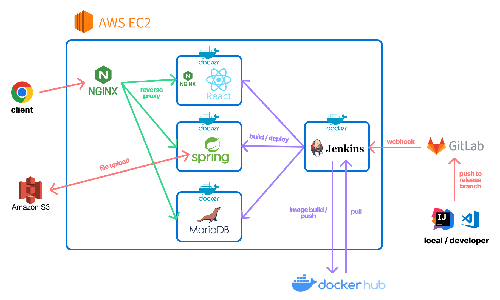

# 무업 청년들 - 무청 컴퍼니

## 목차

- [1. 개요](#1-개요)
- [2. 개발환경](#2-개발환경)
- [3. 아키텍처](#3-아키텍처)
- [4. 주요 서비스화면](#4-주요-서비스화면)
- [5. 주요 기능](#5-주요-기능)
- [6. 기능 상세 설명](#6-기능-상세-설명)
- [7. 설계문서](#7-설계문서)
- [8. 팀원 소개](#8-팀원-소개)

## 1. 개요

- 세상과 단절된 니트족들에게 가상의 회사에 입사하게 하여 니트족들과 회사생활을 꾸릴 수 있다.

- 서로 업무를 하고 인증하며 보고서를 작성할 수 있고 일정을 관리하며 공유할 수 있다.

- 어떤 업무를 할지 모르겠다면 AI에게 업무를 추천받을 수 있다.

- AI assistant가 오늘 하루를 격려해주며 질문을 하고 질문에 답을 하며 하루를 성찰할 수 있다.

## 2. 개발환경

- Issue Management : JIRA
- Communities : MatterMost
- Development Environment

**Frontend**

- 언어 : JavaScript
- 프레임워크 : React
- 패키지 관리자 : npm

> - UI 디자인 : MUI(Material-UI), Emotion
> - 상태 관리: @reduxjs/toolkit
> - 비동기 통신: Axios
> - 데이터 시각화: FullCalendar, MUI x-charts
> - 라우팅: React Router Dom
> - 텍스트 에디터: React Quill
> - 반응형 디자인: React Responsive
> - 스크롤 처리: Simplebar-React
> - 알림 및 대화상자: SweetAlert2

**Backend**

- 언어 : Java
- 프레임워크 : Spring

## 3. 아키텍처

## 4. 주요 서비스화면

| 첫 진입 화면                                                                | 카카오로그인                                                    |
|:----------------------------------------------------------------------:|:---------------------------------------------------------:|
|  |  |

| 채용 프로세스                                                                   | 채용프로세스(인적성검사)                                                    | 채용프로세스(최종제출)                                                       |
|:-------------------------------------------------------------------------:|:--------------------------------------------------------------------------------:|:-------------------------------------------------------------------------------:|
|  |  |  |

| 채용프로세스 - 메일 수신 화면                                           |
|:-----------------------------------------------------------:|
|  |

| 메인페이지(중앙캐릭터 클릭)                                                      | 업무 추천                                                           | 업무 추천 선택                                                           |
|:--------------------------------------------------------------------:|:---------------------------------------------------------------:|:------------------------------------------------------------------:|
|  |  |  |

| 업무 완료                                                          | 업무 완료                                                      | 업무 완료 후 한줄평                                        |
|:--------------------------------------------------------------:|:----------------------------------------------------------:|:--------------------------------------------------:|
|  |  |  |

| 업무 완료 보고                                                | 캘린더 보고서 자동 등록                                                        | 캘린더 보고서 내용 확인                                              |
|:--------------------------------------------------------:|:--------------------------------------------------------------------:|:----------------------------------------------------------:|
|  |  |  |

| 피드                                              | 쪽지 작성                                              |
|:-----------------------------------------------:|:--------------------------------------------------:|
|  |  |

## 

## 5. 주요 기능

- 로그인 - 카카오 소셜 로그인
- 프로필 사진 변경 및 사진 업로드 - aws s3 이미지 업로드 기능
- 업무 - 업무 등록, 제거, 완료 ( 사진 업로드 ), 조회
- 피드 조회 - 무한 스크롤 페이징, 보고서 조회
- 좋아요 - 좋아요 및 좋아요 취소 토글 기능, 개수 조회
- 댓글 - 댓글 생성, 수정, 삭제 및 조회
- 업무 추천 - chatGPT AI기반 유사 업무 추천 기능
- 쪽지(메일) - 유저 간 쪽지 전송, 조회, 유저 이메일 자동완성 검색 기능
- 메일전송(SMTP) - 가입 메일로 회원가입 완료 메일 전송
- 실시간 알림(SSE) - SSE 를 활용한 실시간 알림 기능 및 조회
- AI와 대화 - 오늘 업무에 대해 조언해주는 chatGPT 대화
- AWS S3, CloudFront를 사용한 이미지파일 업로드

## 6. 기능 상세 설명

1. 회원가입, 입사 프로세스
   
   - 무업청년들 서비스를 이용하려면 ‘무업컴퍼니’에 입사 지원을 해야 합니다.
   
   - 카카오 로그인을 통한 인증 후 입사 지원서 작성이 가능합니다.
   
   - 간단한 정보를 입력한 후, 해당되는 지원 동기를 선택합니다.
   
   - 이는 추후 지원자의 부서 배치를 위해 활용됩니다.
   
   - 지원 완료 후에는 이메일로 지원 결과가 발송됩니다.

2. 지원 결과 이메일
   
   - 과연 메일함을 확인해보면 지원 결과 이메일을 받았습니다.
   
   - 설레는 합격 소식! 부서 배치 결과도 안내되었습니다.

3. 출근, 업무 등록
   
   - 이제 설레는 마음으로 출근 도장을 찍으러 이동합니다.
   
   - 출근을 하면 오늘 해야 하는 업무를 등록할 수 있습니다.
   
   - 어떤 목적의 어떤 업무든 모두 좋습니다.
   
   - 무업청년들은 사원들의 모든 업무를 적극적으로 응원합니다!

4. 업무 인증샷 업로드
   
   - 업무를 완료했다면 인증샷 업로드를 통해 업무 완료를 인증합니다.

5. 채팅, 보고서 작성
   
   - 하루 동안의 일과를 마쳤다면, 보고서를 작성해야 합니다.
   
   - 보고서는 동료와의 대화를 거쳐 자동으로 작성됩니다.
   
   - 오늘 하루 동안 진행한 업무와 완료 여부에 대해 동료가 다양한 질문을 던져줍니다.
   
   - 업무 하나하나에 대해서도 생각해볼 부분이 정말 많네요!

6. 업무 보고서, 캘린더
   
   - 동료와의 대화를 마치면 업무 보고서를 직접 수정할 수 있습니다.
   
   - 보고서 작성이 완료되면 캘린더에 등록이 됩니다. 이전에 했던 업무들도 함께 볼 수 있습니다.

7. (다음날) 업무 추천
   
   - 지금까지 해왔던 업무들을 바탕으로 추천 업무들이 배정됩니다.
   
   - 무엇을 할지 모르겠다면 추천을 받아보세요.

8. 공유함
   
   - 보고서를 작성하고, 리뷰를 제출한다면 자동으로 공유가 됩니다.
   
   - 다른 사람들은 무엇을 했는지, 얼마나 달성했는지를 확인해보고 반응을 남겨보세요.

9. 메일 / 알림
   
   - 다른 사람들의 업무 공유를 보고 함께 하고 싶거나, 개인적으로 하고 싶은 말이 있다면 메일 기능을 이용합니다.
   
   - 보다 개인적이고 둘만의 이야기를 나눌 수 있습니다.

## 7. 설계문서

## 8. 팀원 소개

- Backend

|  |  |  |
| -------------------------------------------------------- | -------------------------------------------------------- | -------------------------------------------------------- |
| 소재열(팀장)                                                  | 이수현                                                      | 김이현                                                      |

- Frontend

|  |  |  |
| -------------------------------------------------------- | -------------------------------------------------------- | -------------------------------------------------------- |
| 지준영(FE팀장)                                                | 김승희                                                      | 김태훈                                                      |
