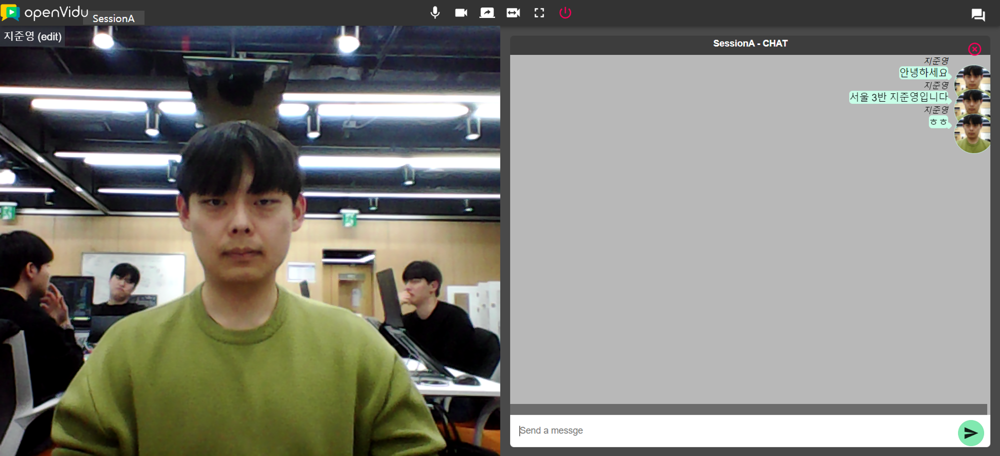

# 일일보고
- 오전에는 WebRTC를 프론트에서 테스트하기 위해 설정하는 작업을 거쳤습니다. 
- 
- 데스크탑에 도커를 설치하고, OpenVidu 튜토리얼을 따라 react기반의 App을 생성함
- 또한, 소켓 통신과 WebRTC 기술의 차이점에 대한 의구심이 들어 동작 구조를 확인했습니다.

- 오후에는 코치세션에서 진행한 Docker, 젠킨스 관련 내용을 다뤘습니다. 
- 젠킨스는 EC2상에서 설정해야한다는 내용이 유익했습니다.
    - 배포는 곧 자신의 IP를 노출하는 것 이므로 DB를 포함한 보안이 매우 중요하다!!!

- 4시에는 컨설팅을 통해 현재 리스트업한 기능들 중에서 우선순위를 통해 일정표를 최우선적으로 산출하라는 피드백을 받았습니다. 
