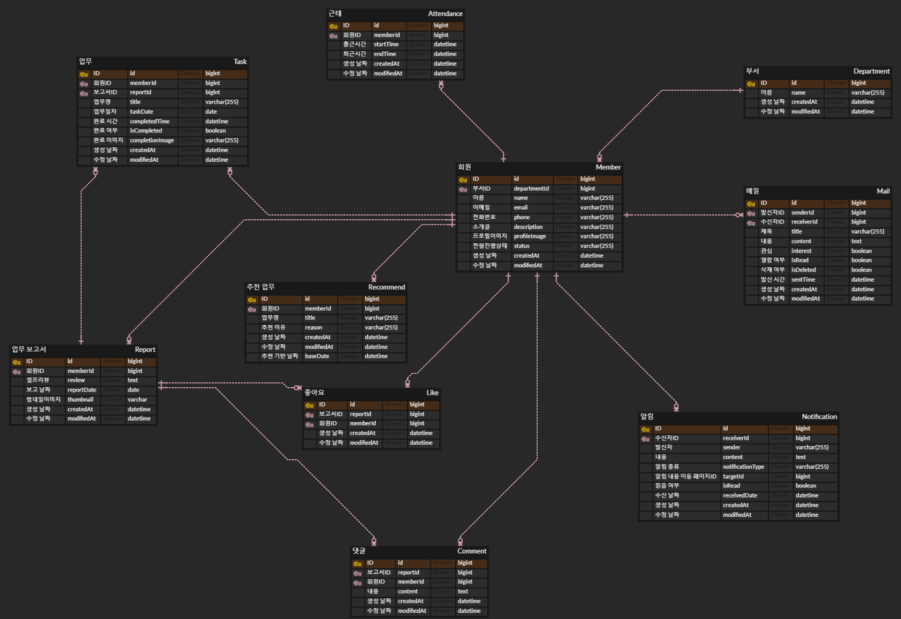

## 기술 스택


### Frontend

- VS Code 24.1.86
- React 18.2.0
- Redux 9.1.0
- npm
- react-router-dom 6.22.0

### Backend

- Intellij ultimate 2023.3
- JDK 11
- Spring Boot 2.7.5
- Spring Cloud 2.2.6
- Spring Data JPA

### Infra

- AWS EC2 (Ubuntu 20.04.6 LTS)
- Nginx 1.18.0 (Ubuntu)
- Certbot 0.40.0
- Docker 25.0.1
- Jenkins 2.443

### Database

- H2 (local)
- MariaDB 2.1.2
- AWS S3

### Communicate

- Jira
- Figma
- Notion
- Mattermost

- `FE` Detail
    - HTML5, CSS3
    - React
    - Redux, Recoil
    - Axios
    - Emotion CSS, styled-component
    - PWA
- `BE` Detail
    - Spring Boot
    - Spring Cloud AWS
    - Spring Data JPA
    - Spring Security
    - SMTP, thymeleaf
    - Server Sent Event
    - Swagger v3
    - Oauth2, JWT
    - Apache.Collection.PatriciaTrie

### External

- Kakao Login
- ChatGPT gpt-3.5-turbo

## 빌드 시 사용되는 환경 변수

- [Spring] application.yml
    
    ```bash
    spring:
      profiles:
        active: dev # 필요할 때마다 이 부분만 원하는 profile로 변경한다
      h2:
        console:
          enabled: true
      security:
        oauth2:
          client:
            registration:
              kakao:
                client-id: "카카오 클라이언트 ID"
                client-secret: "카카오 클라이언트 비밀번호"
                redirect-uri: "카카오 로그인이 정상적으로 됐을 때 응답 받는 주소"
                authorization-grant-type: authorization_code
                client-authentication-method: POST
                client-name: 무청컴퍼니
                scope:
                  - profile_nickname
                  - profile_image
                  - account_email
            provider:
              kakao:
                authorization-uri: https://kauth.kakao.com/oauth/authorize
                issuer-uri: https://kauth.kakao.com
                token-uri: https://kauth.kakao.com/oauth/token
                user-info-uri: https://kapi.kakao.com/v2/user/me
                user-name-attribute: id
      mvc:
        pathmatch:
          matching-strategy: ant_path_matcher
      mail:
        protocol: smtp
        host: smtp.gmail.com
        port: 587
        username: "유저 측에 보내는 발신자 이메일 계정"
        password: "유저 측에 보내는 발신자 이메일 계정 비밀번호"
        properties:
          mail:
            smtp:
              connectiontimeout: 10000
              auth: true
              starttls:
                enable: true
                required: true
    jwt:
      header: Authorization
      secret: "JWT secret"
      token-validity-in-seconds: 86400
    cloud:
      aws:
        credentials:
          access-key: "AWS access key"
          secret-key: "AWS secret key"
        s3:
          bucket: "bucket 이름"
        region:
          static: ap-northeast-2
        stack:
          auto: false
    ```
    
- [Spring] application-dev.yml
    
    ```bash
    # 팀원들과 공유하는 개발 환경 → EC2 서버에 Docker 컨테이너로 띄운 우리만의 MariaDB 사용
    spring:
      config:
        activate:
          on-profile: dev
      datasource:
        driver-class-name: org.mariadb.jdbc.Driver
        url: "MariaDB 접속 URL"
        username: "MariaDB 유저 ID"
        password: "MariaDB 유저 PW"
      jpa:
        hibernate:
          ddl-auto: update
        show-sql: true
        properties:
          hibernate:
            dialect: org.hibernate.dialect.MySQL5InnoDBDialect
            format_sql: true
    ```
    
- [Spring] Dockerfile
    
    ```docker
    FROM openjdk:11
    EXPOSE 8080
    
    ARG JAR_FILE=build/libs/*.ja
    COPY ${JAR_FILE} app.jar
    
    ENV TZ Asia/Seoul
    
    ENTRYPOINT ["java", "-jar", "app.jar"]
    ```
    
- [React] Dockerfile
    
    ```docker
    FROM node:20.10.0 as build-stage
    
    ENV REACT_APP_CHATGPT_API_TOKEN "ChatGPT API Token"
    
    #폴더 위치
    RUN mkdir -p /app
    WORKDIR /app
    ADD . .
    
    #yarn 설치
    RUN npm install
    RUN npm run build
    
    ENV TZ Asia/Seoul
    
    # production stage
    FROM nginx:stable-alpine as production-stage
    COPY  ./nginx/nginx.conf /etc/nginx/conf.d/default.conf
    
    COPY --from=build-stage /app/build /usr/share/nginx/html
    EXPOSE 3000
    CMD ["nginx", "-g", "daemon off;"]
    ```
    
- docker-compose.yml
    
    ```yaml
    version: "3"
    services:
      spring-app: # app 서비스
        container_name: spring-app # 컨테이너 이름
        image: skylarlee0/spring-app
        ports: # 포트포워딩
          - 5000:8080 # HTTP 포트 연결
        restart: always
      react-app:
        container_name: react-app
        image: skylarlee0/react-app
        ports:
          - 3000:3000
    		restart: always
    ```
    
- [Jenkins] pipeline script
    
    ```bash
    def FE_CHANGED = false
    def BE_CHANGED = false
    
    def BASIC_PATH = "/var/jenkins_home/workspace/gitlab-pipeline/"
    
    def BE_SETTING_FILES = "/var/jenkins_home/setting-files-suhyeon/be-spring/"
    def BE_SRC = "/var/jenkins_home/workspace/gitlab-pipeline/BE/muchung/src/"
    
    def BE_IMG_NAME = "skylarlee0/spring-app"
    def BE_CONTAINER_NAME = "spring-app"
    
    def FE_SETTING_FILES = "/var/jenkins_home/setting-files-suhyeon/fe-react/"
    def FE_SRC = "/var/jenkins_home/workspace/gitlab-pipeline/FE/"
    
    def FE_IMG_NAME = "skylarlee0/react-app"
    def FE_CONTAINER_NAME = "react-app"
    
    pipeline{
        agent any
        environment{
            DOCKERHUB_CREDENTIAL = credentials('docker-hub-id')
        }
        stages {
            stage('Checkout'){
                steps {
                    git branch: 'release', credentialsId: 'gitlab-id', url: 'https://lab.ssafy.com/s10-webmobile2-sub2/S10P12A307.git'
                    script{
                        def feChanges = false
                        def beChanges = false
                        def changedFiles = sh(
                                script : "git diff --name-only HEAD HEAD~1",
                                returnStdout : true
                        ).trim().split("\n")
                        for(def file : changedFiles) {
                            if(file.startsWith("FE/")){
                                feChanges = true
                            }
                            if (file.startsWith("BE/")){
                                beChanges = true
                            }
                        }
                        // env.FE_CHANGED = feChanges
                        // env.BE_CHANGED = beChanges
    
                        env.FE_CHANGED = true
                        env.BE_CHANGED = true
    
                        echo "Did FE change? ${env.FE_CHANGED}"
                        echo "Did BE change? ${env.BE_CHANGED}"
                    }
                }
            }
            stage("Copy Setting Files"){
                when {
                    expression { return env.BE_CHANGED == "true"}
                }
                steps{
                    dir("."){
                        // sh "cp ../../setting-files-suhyeon/be-spring/env-setting/* ./BE/muchung/src/main/resources/"
                        sh "cp ${BE_SETTING_FILES}env-setting/* ${BE_SRC}main/resources/"
                        sh "mkdir -p ./BE/muchung/src/test/resources"
                        sh "cp ${BE_SETTING_FILES}env-setting/* ./BE/muchung/src/test/resources/"
                        sh "cp ${BE_SETTING_FILES}MuchungApplicationTests.java ${BE_SRC}test/java/ssafy/muchung/MuchungApplicationTests.java"
                        sh "cp ${BE_SETTING_FILES}Dockerfile-be ./BE/muchung/Dockerfile"
                        sh "cp ${FE_SETTING_FILES}Dockerfile-fe ./FE/Dockerfile"
                        sh "cp ${FE_SETTING_FILES}env-setting/.env ./FE/.env"
                    }
                }
            }
            stage("[BE] Compile"){
                when {
                    expression { return env.BE_CHANGED == "true"}
                }
                steps{
                    dir("./BE/muchung"){
                        // sh "rm ./src/main/java/ssafy/muchung/global/config/CorsConfig.java"
                        sh "chmod +x gradlew"
                        sh "./gradlew build"
                    }
                }
            }
            stage("[BE] Docker build"){
                when {
                    expression { return env.BE_CHANGED == "true" }
                }
                steps{
                    script {
                        // 1) 기존의 도커 이미지가 존재하는지 확인
                        def hasBeDockerImg = sh(encoding: 'UTF-8', returnStdout: true, script: "docker images -q ${BE_IMG_NAME}").trim()
                        echo "hasBeDockerImg : ${hasBeDockerImg}"
    
                        if (hasBeDockerImg) {
                            // 2) 도커 컨테이너가 돌아가고 있는지 확인
                            def isBeContainerRunning = sh(encoding: 'UTF-8', returnStdout: true, script: "docker ps -q --filter ancestor=${BE_IMG_NAME}").trim()
                            echo "isBeContainerRunning : ${isBeContainerRunning}"
    
                            if (isBeContainerRunning) {
                                sh "docker stop ${isBeContainerRunning}"
                                sh "docker rm ${isBeContainerRunning}"
                            }
    
                            sh "docker rmi ${BE_IMG_NAME}"
                        }
                    }
                    dir("./BE/muchung"){
                        sh "docker build -t ${BE_IMG_NAME} ."
                    }
                }
            }
            stage("[BE] Docker push"){
                when {
                    expression { return env.BE_CHANGED == "true" }
                }
                steps {
                    dir("./BE"){
                        sh "docker login -u ${DOCKERHUB_CREDENTIAL_USR} -p ${DOCKERHUB_CREDENTIAL_PSW}"
                        sh "docker push ${BE_IMG_NAME}"
                    }
                }
            }
            stage("[BE] Docker pull"){
                when {
                    expression { return env.BE_CHANGED == "true" }
                }
                steps{
                    script {
                        sh "docker pull ${BE_IMG_NAME}"
                    }
                }
            }
            stage("[FE] Docker build"){
                when {
                    expression { return env.FE_CHANGED == "true" }
                }
                steps{
                    script {
                        // 1) 기존의 도커 이미지가 존재하는지 확인
                        def hasFeDockerImg = sh(encoding: 'UTF-8', returnStdout: true, script: "docker images -q ${FE_IMG_NAME}").trim()
                        echo "hasFeDockerImg : ${hasFeDockerImg}"
    
                        if (hasFeDockerImg) {
                            // 2) 도커 컨테이너가 돌아가고 있는지 확인
                            def isFeContainerRunning = sh(encoding: 'UTF-8', returnStdout: true, script: "docker ps -q --filter ancestor=${FE_IMG_NAME}").trim()
                            echo "isFeContainerRunning : ${isFeContainerRunning}"
    
                            if (isFeContainerRunning) {
                                sh "docker stop ${isFeContainerRunning}"
                                sh "docker rm ${isFeContainerRunning}"
                            }
    
                            sh "docker rmi ${FE_IMG_NAME}"
                        }
                    }
                    dir("./FE"){
                        sh "docker build -t ${FE_IMG_NAME} ."
                    }
                }
            }
            stage("[FE] Docker push"){
                when {
                    expression { return env.FE_CHANGED == "true" }
                }
                steps {
                    dir("./FE"){
                        sh "docker push ${FE_IMG_NAME}"
                    }
                }
            }
            stage("[FE] Docker pull"){
                when {
                    expression { return env.FE_CHANGED == "true" }
                }
                steps{
                    sh "docker pull ${FE_IMG_NAME}"
                }
            }
            stage("Container Down & Up"){
                steps{
                    dir("../../setting-files-suhyeon/"){
                        sh """
                            docker compose down
                            docker compose up -d
                            docker compose convert
                        """
                    }
                }
            }
        }
    }
    ```
    

## ERD



## MariaDB 접속 정보 (대외비)

```markdown
url: jdbc:mariadb://i10a307.p.ssafy.io/muchung
username: noisycart
password: snackgiver
```

## 서버 설정 (대외비)

- Nginx 설정 `/etc/nginx/sites-available/default`
    
    ```bash
    # 80 포트로 접근 시 443 포트로 redirect
    server {
        listen 80;
        server_name i10a307.p.ssafy.io;
        return 301 https://$host$request_uri;
    }
    
    # 443 포트로 접근 시 ssl 적용 후 포워딩
    server {
        listen 443 ssl; # managed by Certbot
        listen [::]:443 ssl ipv6only=on; # managed by Certbot
        server_name i10a307.p.ssafy.io; # managed by Certbot
    
        ssl_certificate /etc/letsencrypt/live/i10a307.p.ssafy.io/fullchain.pem; # managed by Certbot
        ssl_certificate_key /etc/letsencrypt/live/i10a307.p.ssafy.io/privkey.pem; # managed by Certbot
    
        include /etc/letsencrypt/options-ssl-nginx.conf; # managed by Certbot
        ssl_dhparam /etc/letsencrypt/ssl-dhparams.pem; # managed by Certbot
    
        # spring-app으로 포워딩
    		location /api/ {
    		    proxy_pass http://172.17.0.1:5000/;
    		    
    				proxy_set_header Host $host;
    	      proxy_set_header X-Real-IP $remote_addr;
    	      proxy_set_header X-Forwarded-For $proxy_add_x_forwarded_for;
    	      access_log /var/log/nginx/spring.log main;
    
    				proxy_set_header Connection '';
    				proxy_http_version 1.1;
    				chunked_transfer_encoding off;
    		}
    
    		# react-app으로 포워딩
        location / {
    	      proxy_pass http://172.17.0.1:3000;
    	      
    	      proxy_set_header Host $host;
    	      proxy_set_header X-Real-IP $remote_addr;
    	      proxy_set_header X-Forwarded-For $proxy_add_x_forwarded_for;
    	      access_log /var/log/nginx/react.log main;
    	  }
    
    	  # MariaDB 도커 컨테이너로 포워딩
    	  location = /db/winter {
    	      proxy_pass http://172.17.0.1:3306;
    	  }
    }
    ```
    
- 실행 중인 docker 컨테이너 `docker ps`
    
    ```bash
    CONTAINER ID   IMAGE                    COMMAND                  CREATED       STATUS       PORTS                                                  NAMES
    999b9de62aa5   skylarlee0/react-app     "/docker-entrypoint.…"   6 hours ago   Up 6 hours   80/tcp, 0.0.0.0:3000->3000/tcp, :::3000->3000/tcp      react-app
    2273d613b3fa   skylarlee0/spring-app    "java -jar app.jar"      6 hours ago   Up 6 hours   0.0.0.0:5000->8080/tcp, :::5000->8080/tcp              spring-app
    35d6514edaaa   mariadb:latest           "docker-entrypoint.s…"   11 days ago   Up 11 days   0.0.0.0:3306->3306/tcp, :::3306->3306/tcp              mariadb
    4b693aaa4966   jenkins/jenkins:latest   "/usr/bin/tini -- /u…"   2 weeks ago   Up 10 days   50000/tcp, 0.0.0.0:9090->8080/tcp, :::9090->8080/tcp   jenkins-dawn
    ```
    

---

## 기능

- `로그인` 카카오 소셜 로그인
- `파일 업로드` 프로필 사진 변경, 업무 인증샷 업로드 (AWS S3)
- `업무` 업무 등록, 제거, 완료(인증샷 업로드), 조회
- `피드` 게시글 조회 : 무한 스크롤 페이징(버티컬 스크롤)
- `피드` 좋아요 : 좋아요 설정/취소, 개수 조회
- `피드` 댓글 : 댓글 생성, 수정, 삭제 및 조회
- `보고서 작성` ChatGPT : 유저 데이터 기반 질문 생성, 일기 작성(대화 요약), 업무 추천
- `쪽지` 유저 간 쪽지 전송, 조회, 유저 이메일 자동완성 검색
- `메일 발송(SMTP)` 회원가입 시 지원 결과 메일 전송
- `실시간 알림(SSE)` 실시간 알림 생성, 조회

## 기술 특장점 (핵심 기술)

- Server Sent Event를 활용한 실시간 알림
- ChatGPT 기반 대화 생성, 요약, 추천
- AWS S3를 사용한 파일 업로드
